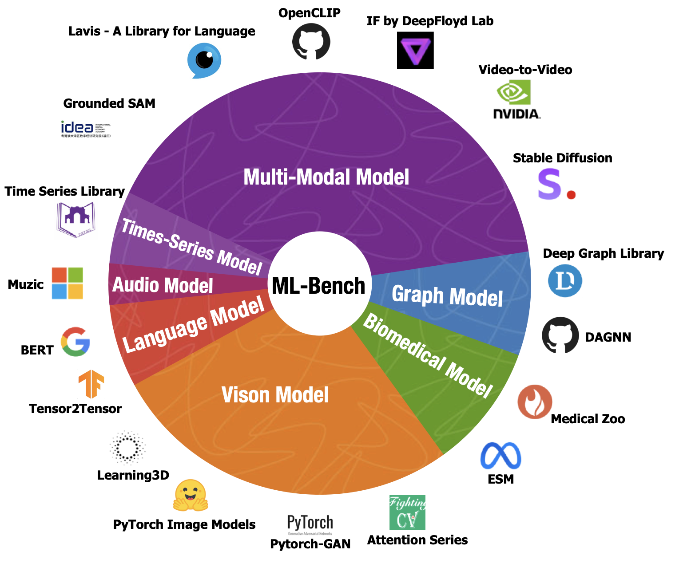

# ML-Bench: Evaluating Large Language Models and Agents for Machine Learning Tasks on Repository-Level Code



## Table of Contents
- 📋 [Prerequisites](#-prerequisites)
- 📊 [Data Preparation](#-data-preparation)
- 🦙 [ML-LLM-Bench](#-ml-llm-bench)
  - 📋 [Prerequisites](#-prerequisites-1)
  - 🌍 [Environment Setup](#-environment-setup)
  - 🛠️ [Usage](#%EF%B8%8F-usage)
  - 📞 [API Calling](#-api-calling)
  - 🔧 [Open Source Model Fine-tuning](#-open-source-model-fine-tuning)
    - 📋 [Prerequisites](#-prerequisites-2)
    - 🏋️ [Fine-tuning](#%EF%B8%8F-fine-tuning)
    - 🔍 [Inference](#-inference)
- 🤖 [ML-Agent-Bench](#-ml-agent-bench)
  - 🌍 [Environment Setup](#-environment-setup-1)
- 📝 [Cite Us](#-cite-us)
- 📜 [License](#-license)


## 📋 Prerequisites

To clone this repository with all its submodules, use the `--recurse-submodules` flag:

```bash
git clone --recurse-submodules https://github.com/gersteinlab/ML-Bench.git
cd ML-Bench
```

If you have already cloned the repository without the `--recurse-submodules` flag, you can run the following commands to fetch the submodules:

```bash
git submodule update --init --recursive
```

Download and install [Nix package manager](https://nixos.org/download/) and run:

```
nix develop -c $SHELL
```

## 📊 Data Preparation

You can load the dataset using the following code:

```python
from datasets import load_dataset

ml_bench = load_dataset("super-dainiu/ml-bench")    # splits: ['full', 'quarter']
```

The dataset contains the following columns:
- `github_id`: The ID of the GitHub repository.
- `github`: The URL of the GitHub repository.
- `repo_id`: The ID of the sample within each repository.
- `id`: The unique ID of the sample in the entire dataset.
- `path`: The path to the corresponding folder in LLM-Bench.
- `arguments`: The arguments specified in the user requirements.
- `instruction`: The user instructions for the task.
- `oracle`: The oracle contents relevant to the task.
- `type`: The expected output type based on the oracle contents.
- `output`: The ground truth output generated based on the oracle contents.
- `prefix_code`: The code snippet for preparing the execution environment

If you want to run ML-LLM-Bench, you need to do post-processing on the dataset. You can use the following code to post-process the dataset:

```bash
bash scripts/post_process/prepare.sh
```

See [post_process](scripts/post_process/README.md) for more details.

## 🦙 ML-LLM-Bench

### 📋 Prerequisites

   After clone submodules, you can run 

   `cd scripts/post_process`

   `bash prepare.sh` to generate full and quarter benchmark into `merged_full_benchmark.jsonl` and `merged_quarter_benchmark.jsonl`

   You can change `readme_content = fr.read()` in `merge.py`, line 50 to `readme_content = fr.read()[:100000]` to get 32k length README contents or to `readme_content = fr.read()[:400000]` to get 128k length README contents.
   
   Under the 128k setting, users can prepare trainset and testset in 10 mins with 10 workers. Without token limitation, users may need 2 hours to prepare the whole dataset and get a huge dataset.

### 🌍 Environment Setup


   To run the ML-LLM-Bench Docker container, you can use the following command:
   
   ```bash
   docker pull public.ecr.aws/i5g0m1f6/ml-bench
   docker run -it -v ML_Bench:/deep_data public.ecr.aws/i5g0m1f6/ml-bench /bin/bash
   ```

   To download model weights and prepare files, you can use the following command:

   ```bash
   bash utils/download_model_weight_pics.sh
   ```

   It may take 2 hours to automatically prepare them.

### 🛠️ Usage


   Place your results in `output/` directory, and update the `--input_path` in `exec.sh` with your path. Also, modify the log address. 
   
   Then run `bash utils/exec.sh`. And you can check the run logs in your log file, view the overall results in `output/{{MODEL_NAME}}_{{TASK}}_results_{{TIMESTAMP}}.jsonl`, and see the results for each repository in `output/{{MODEL_NAME}}_{{TASK}}_results_{{TIMESTAMP}}.jsonl`.
   
   
   Both JSONL files starting with `eval_result` and `eval_total` contain partial execution results in our paper.
   
  - The `output/` folder includes the model-generated outputs we used for testing.
      
  - The `logs/` folder saves our the execute log.
      
  - The `utils/temp.py` file is not for users, it is used to store the code written by models.
      
  - Additionally, the execution process may generate new unnecessary files.


### 📞 API Calling

To reproduce OpenAI's performance on this task, use the following script:
```bash
bash script/openai/run.sh
```

You need to change the parameter settings in `script/openai/run.sh`:

- `type`: Choose from `quarter` or `full`.
- `model`: Model name.
- `input_file`: File path of the dataset.
- `answer_file`: Original answer in JSON format from GPT.
- `parsing_file`: Post-process the output of GPT in JSONL format to obtain executable code segments.
- `readme_type`: Choose from `oracle_segment` and `readme`.
  - `oracle_segment`: The code paragraph in the README that is most relevant to the task.
  - `readme`: The entire text of the README in the repository where the task is located.
- `engine_name`: Choose from `gpt-35-turbo-16k` and `gpt-4-32`.
- `n_turn`: Number of executable codes GPT returns (5 times in the paper experiment).
- `openai_key`: Your OpenAI API key.

Please refer to [openai](scripts/openai/README.md) for details.

### 🔧 Open Source Model Fine-tuning

#### 📋 Prerequisites
Llama-recipes provides a pip distribution for easy installation and usage in other projects. Alternatively, it can be installed from the source.

1. **Install with pip**
```
pip install --extra-index-url https://download.pytorch.org/whl/test/cu118 llama-recipes
```
2. **Install from source**
To install from source e.g. for development use this command. We're using hatchling as our build backend which requires an up-to-date pip as well as setuptools package.
```
git clone https://github.com/facebookresearch/llama-recipes
cd llama-recipes
pip install -U pip setuptools
pip install --extra-index-url https://download.pytorch.org/whl/test/cu118 -e .
```

#### 🏋️ Fine-tuning
By definition, we have three tasks in the paper.
* Task 1: Given a task description + Code, generate a code snippet.
* Task 2: Given a task description + Retrieval, generate a code snippet.
* Task 3: Given a task description + Oracle, generate a code snippet.

You can use the following script to reproduce CodeLlama-7b's fine-tuning performance on this task：
```bash
torchrun --nproc_per_node 2 finetuning.py \
    --use_peft \
    --peft_method lora \
    --enable_fsdp \
    --model_name codellama/CodeLlama-7b-Instruct-hf \
    --context_length 8192 \
    --dataset mlbench_dataset \
    --output_dir OUTPUT_PATH \
    --task TASK \
    --data_path DATA_PATH \
```

You need to change the parameter settings of `OUTPUT_PATH`, `TASK`, and `DATA_PATH` correspondingly.
* `OUTPUT_DIR`: The directory to save the model.
* `TASK`: Choose from `1`, `2` and `3`.
* `DATA_PATH`: The directory of the dataset.

#### 🔍 Inference
You can use the following script to reproduce CodeLlama-7b's inference performance on this task：
```bash
python chat_completion.py \
    --model_name 'codellama/CodeLlama-7b-Instruct-hf' \
    --peft_model PEFT_MODEL \
    --prompt_file PROMPT_FILE \
    --task TASK \
```

You need to change the parameter settings of `PEFT_MODEL`, `PROMPT_FILE`, and `TASK` correspondingly.
* `PEFT_MODEL`: The path of the PEFT model.
* `PROMPT_FILE`: The path of the prompt file.
* `TASK`: Choose from `1`, `2` and `3`.

Please refer to [finetune](scripts/finetune/README.md) for details.

## 🤖 ML-Agent-Bench
### 🌍 Environment Setup

To run the ML-Agent-Bench Docker container, you can use the following command:

```bash
docker pull public.ecr.aws/i5g0m1f6/ml-bench
docker run -it public.ecr.aws/i5g0m1f6/ml-bench /bin/bash
```

This will pull the latest ML-Agent-Bench Docker image and run it in an interactive shell. The container includes all the necessary dependencies to run the ML-Agent-Bench codebase.

For ML-Agent-Bench in OpenDevin, please refer to the [OpenDevin setup guide](https://github.com/OpenDevin/OpenDevin/blob/main/evaluation/ml_bench/README.md).

Please refer to [envs](envs/README.md) for details.

## 📜 License

Distributed under the MIT License. See [`LICENSE`](./LICENSE) for more information.


